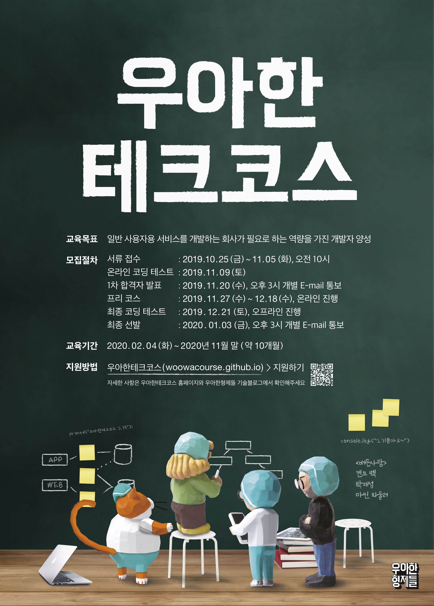

# 👨🏻‍💻 woowacourse-projects

    

>  2020.02.04 ~ 2020.11.27 [우아한테크코스](https://woowacourse.github.io/)에서 '둔덩'으로 활동하고 학습한 내용을 정리하는 Repository

 

## ⏳ Level 0 : 프리코스

### 기간

- 2019.11.27 ~ 2019.12.17

### 진행 미션

|     Project      |                          Repository                          |                         Pull Request                         |
| :--------------: | :----------------------------------------------------------: | :----------------------------------------------------------: |
|  숫자 야구 게임  | [java-baseball-precourse](https://github.com/lxxjn0/java-baseball-precourse) | [Pull Request](https://github.com/woowacourse/java-baseball-precourse/pull/192) |
| 자동차 경주 게임 | [java-racingcar-precourse](https://github.com/lxxjn0/java-racingcar-precourse) | [Pull Request](https://github.com/woowacourse/java-racingcar-precourse/pull/181) |
|      블랙잭      | [java-blackjack-precourse](https://github.com/lxxjn0/java-blackjack-precourse) | [Pull Request](https://github.com/woowacourse/java-blackjack-precourse/pull/80) |

 

## ⌛️ Level 0.5 : 오프라인 테스트

### 기간

- 2019.12.24

### 진행 미션

| Project |                          Repository                          |                         Pull Request                         |
| :-----: | :----------------------------------------------------------: | :----------------------------------------------------------: |
| 치킨집  | [java-chicken-2019](https://github.com/lxxjn0/java-chicken-2019) | [Pull Request](https://github.com/woowacourse/java-chicken-2019/pull/24) |

 

## 🥚 Level 1 : 프로그래밍 기본

### 기간

- 2020.02.04 ~ 2020.04.10

### 학습 목표

- 자바 프로그래밍 언어에 대한 기본 문법을 익혀 프로그래밍하는 경험을 한다.
- 읽기 좋은 코드를 구현하는 것이 왜 중요한지와 코드를 개선해 읽기 좋은 코드로 변경해 보는 경험을 한다.
- 자신이 구현한 코드에 대해 단위 테스트와 리팩토링하는 경험을 한다.
- 웹 프론트엔드에서 웹 백엔드까지 프로그래밍해 웹 애플리케이션을 개발하는 경험을 한다.

### 진행 미션

|     Project      |                          Repository                          |                         Pull Request                         |
| :--------------: | :----------------------------------------------------------: | :----------------------------------------------------------: |
|  문자열 계산기   | [java-calculator](https://github.com/lxxjn0/java-calculator) | [Pull Request](https://github.com/woowacourse/java-calculator/pull/46) |
| 자동차 경주 게임 |  [java-racingcar](https://github.com/lxxjn0/java-racingcar)  | [Pull Request](https://github.com/woowacourse/java-racingcar/pull/101) |
|   로또 / step1   | [java-lotto/step1](https://github.com/lxxjn0/java-lotto/tree/step1) | [Pull Request](https://github.com/woowacourse/java-lotto/pull/160) |
|   로또 / step2   | [java-lotto/step2](https://github.com/lxxjn0/java-lotto/tree/step2) | [Pull Request](https://github.com/woowacourse/java-lotto/pull/182) |
|  블랙잭 / step1  | [java-blackjack/step1](https://github.com/lxxjn0/java-blackjack/tree/step1) | [Pull Request](https://github.com/woowacourse/java-blackjack/pull/40) |
|  블랙잭 / step2  | [java-blackjack/step2](https://github.com/lxxjn0/java-blackjack/tree/step2) | [Pull Request](https://github.com/woowacourse/java-blackjack/pull/85) |
|   체스 / step1   | [java-chess/step1](https://github.com/lxxjn0/java-chess/tree/step1) | [Pull Request](https://github.com/woowacourse/java-chess/pull/91) |
|   체스 / step2   | [java-chess/step2](https://github.com/lxxjn0/java-chess/tree/step2) | [Pull Request](https://github.com/woowacourse/java-chess/pull/132) |
|   90년생 HTML    |            [html](https://github.com/lxxjn0/html)            | [Pull Request](https://github.com/woowacourse/html/pull/22)  |

 

## 🐣 Level 2 : 웹 프로그래밍과 미니 팀 프로젝트

### 기간

- 2020.04.21 ~ 2020.06.19

### 학습 목표

- Spring 프레임워크 기반으로 웹 애플리케이션을 개발하는 경험을 한다.
- TDD, ATDD 기반으로 웹 애플리케이션을 개발하고 리팩토링하는 경험을 한다.
- 구현한 프로그램을 서버에 배포하는 경험을 한다.
- 팀 프로젝트를 통해 팀원들간의 소통, 협업, 회고 경험을 한다.

### 진행 미션

|       Project        |                          Repository                          |                         Pull Request                         |
| :------------------: | :----------------------------------------------------------: | :----------------------------------------------------------: |
|     체스 / step1     | [jwp-chess/step1](https://github.com/lxxjn0/jwp-chess/tree/step1) | [Pull Request](https://github.com/woowacourse/jwp-chess/pull/31) |
|     체스 / step2     | [jwp-chess/step2](https://github.com/lxxjn0/jwp-chess/tree/step2) | [Pull Request](https://github.com/woowacourse/jwp-chess/pull/88) |
|     체스 / step3     | [jwp-chess/step3](https://github.com/lxxjn0/jwp-chess/tree/step3) | [Pull Request](https://github.com/woowacourse/jwp-chess/pull/131) |
|     체스 / step4     | [jwp-chess/step4](https://github.com/lxxjn0/jwp-chess/tree/step4) | [Pull Request](https://github.com/woowacourse/jwp-chess/pull/213) |
|   지하철 정보 관리   | [atdd-subway-admin](https://github.com/lxxjn0/atdd-subway-admin) | [Pull Request](https://github.com/woowacourse/atdd-subway-admin/pull/11) |
|   지하철 경로 조회   | [atdd-subway-path](https://github.com/lxxjn0/atdd-subway-path) | [Pull Request](https://github.com/woowacourse/atdd-subway-path/pull/31) |
| 지하철 경로 즐겨찾기 | [atdd-subway-favorite](https://github.com/lxxjn0/atdd-subway-favorite) | [Pull Request](https://github.com/woowacourse/atdd-subway-favorite/pull/20) |
|  지하철 Admin CRUD   | [atdd-subway-admin-frontend](https://github.com/lxxjn0/atdd-subway-admin-frontend) | [Pull Request](https://github.com/woowacourse/atdd-subway-admin-frontend/pull/55) |
|    사용자 이야기     | [woowa-userstory-2020](https://github.com/lxxjn0/woowa-userstory-2020) | [Pull Request](https://github.com/woowacourse/woowa-userstory-2020/pull/45) |

 

## 📹 Tecotalk : 크루들에게 지식을 공유하는 방법

### 발표 주제 : 빌드와 배포

- [둔덩의 교착 상태 - Youtube](https://www.youtube.com/watch?v=FXzBRD3CPlQ)

 

## 🐥 Level 3 : 팀 프로젝트

### 기간

- 2020.07.07 ~ 2020.08.28

### 학습 목표

- 개발 프로세스 기반으로 프로젝트 진행, 협업하는 경험을 한다.
- 배포를 자동화하고, 피드백을 받아 지속적으로 개선하는 경험을 한다.

### 진행 미션

- 당신이 모르는 그곳, 미소

 

## 당신이 모르는 그곳, 미소 : Instrgram 인기게시물 지도화 서비스

### 서비스

- [미소 데모 사이트](https://sites.google.com/woowahan.com/wooteco-demo/%EB%AF%B8%EC%86%8C)
- [당신이 모르는 그곳, 미소](https://themiso.kr/)

### Github Repository

- [woowacourse-teams/2020-songpa-people](https://github.com/woowacourse-teams/2020-songpa-people)

### 관련 영상

- [2차 데모 - 빌드, 배포 그리고 자동화](https://www.youtube.com/watch?v=Oqt1OFo_jpA&list=PLgXGHBqgT2TsWUA5puZimG3DDlJTd370Q)
- [3차 데모 - HTTPS, 문서화, Admin, 팀문화와 워크샵](https://www.youtube.com/watch?v=OYnQt2kHWug&list=PLgXGHBqgT2TsWUA5puZimG3DDlJTd370Q)
- [프로젝트 소개 - 미소](https://www.youtube.com/watch?v=2xjXCl2Hdp8&list=PLgXGHBqgT2TsWUA5puZimG3DDlJTd370Q)

 

## 🐓 Level 4 : 팀 프로젝트 유지 보수 및 웹 백엔드에 깊이를 더하는 단계

### 기간

- 2020.09.08 ~ 2020.11.27

### 학습 목표

- 웹 서버를 직접 구현해 HTTP를 이해하고, 서블릿 컨테이너의 동작 원리를 이해한다.
- JDBC 라이브러리, MVC, DI 프레임워크 구현을 통해 Spring 프레임워크의 동작 원리를 이해한다.
- 레거시 프로젝트를 리팩토링하는 경험을 한다.
- 객체지향 설계, 인증 및 보안, WebSocket 경험을 한다.
- 대용량 서비스를 위한 시스템 아키텍처 설계, 데이터 처리 경험을 한다.

### 진행 미션

- comming soon...

 

## 🖋 Writing : 글쓰기 코스

### 진행 미션

| Level |                 Topic                  |                          Repository                          |                         Pull Request                         |
| :---: | :------------------------------------: | :----------------------------------------------------------: | :----------------------------------------------------------: |
|   1   |      우아한테크코스 한 달 생활기       | [woowa-writing-2/level1](https://github.com/lxxjn0/woowa-writing-2/tree/level1/level-1) | [Pull Request](https://github.com/woowacourse/woowa-writing-2/pull/40) |
|   2   | 우테코에서 찾은 나만의 효과적인 학습법 | [woowa-writing-2/level2](https://github.com/lxxjn0/woowa-writing-2/tree/level2/level-2) | [Pull Request](https://github.com/woowacourse/woowa-writing-2/pull/79) |
|   3   |      팀 프로젝트가 나에게 남긴 것      | [woowa-writing-2/level3](https://github.com/lxxjn0/woowa-writing-2/tree/level3/level-3) | [Pull Request](https://github.com/woowacourse/woowa-writing-2/pull/157) |
|   4   |    내가 꿈꾸는 프로그래머로서의 삶     | [woowa-writing-2/level4](https://github.com/lxxjn0/woowa-writing-2/blob/level4/level-4/README.md) | [Pull Request](https://github.com/woowacourse/woowa-writing-2/pull/175) |

 

## 🗃 Javable : 우아한테크코스 코드 리뷰 모음 블로그

### 서비스

- [Javable 블로그](https://woowacourse.github.io/javable/)

### Github Repository

- [javable](https://github.com/woowacourse/javable)

### 활동 내용

- [기능 구현 - 블로그 글 공유 기능](https://github.com/woowacourse/javable/pull/217)
- [블로그 글 알림을 받기 위한 RSS 추가](https://github.com/woowacourse/javable/pull/151)
- [포스팅 - null 반환보다는 Optional을 활용하자](https://woowacourse.github.io/javable/2020-04-21/optional-vs-null)
- [포스팅 - 하드코딩을 피해라.](https://woowacourse.github.io/javable/2020-05-07/avoid-hard-coding)
- [포스팅 - 상속보다는 조합(Composition)을 사용하자.](https://woowacourse.github.io/javable/2020-05-18/inheritance-vs-composition)
- [포스팅 - 디미터 법칙(Law of Demeter)](https://woowacourse.github.io/javable/2020-06-02/law-of-demeter)
- [포스팅 - String 클래스를 조심히 사용하자.](https://woowacourse.github.io/javable/2020-06-15/String-vs-StringBuilder-vs-StringBuffer)
- [포스팅 - Reflection API 간단히 알아보자.](https://woowacourse.github.io/javable/2020-07-16/reflection-api)
- [포스팅 - equals와 hashCode는 왜 같이 재정의해야 할까?](https://woowacourse.github.io/javable/2020-07-29/equals-and-hashCode)
- [포스팅 - MockMvc VS RestAssured](https://woowacourse.github.io/javable/2020-08-19/rest-assured-vs-mock-mvc)
- [포스팅 - 자바 반복문 알고 쓰자!](https://woowacourse.github.io/javable/2020-08-31/java-loop)
- [포스팅 - 자바 빌드 도구](https://woowacourse.github.io/javable/2020-09-17/java-build-tool)
- [포스팅 - Collection.forEach와 Stream.forEach는 뭐가 다를까?(진행중)](#)
- [포스팅 - 몸체가 비어있는 무한 루프(진행중)](#)
- [포스팅 - 자바 제네릭(Generics) 기초(진행중)](#)

